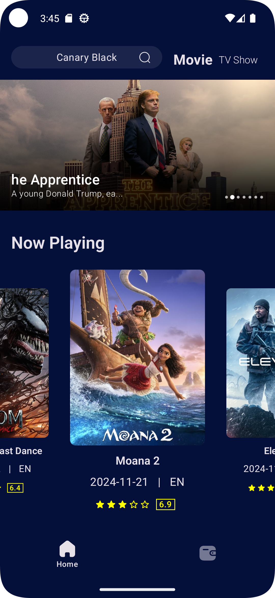
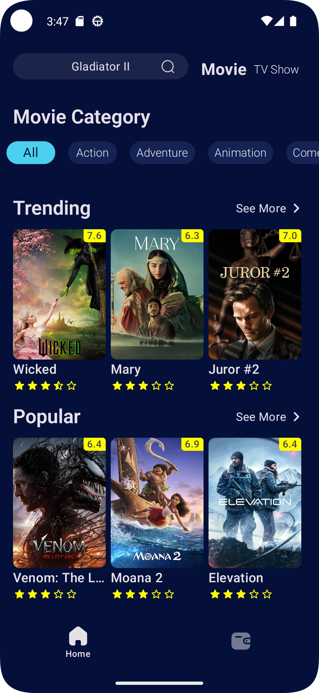
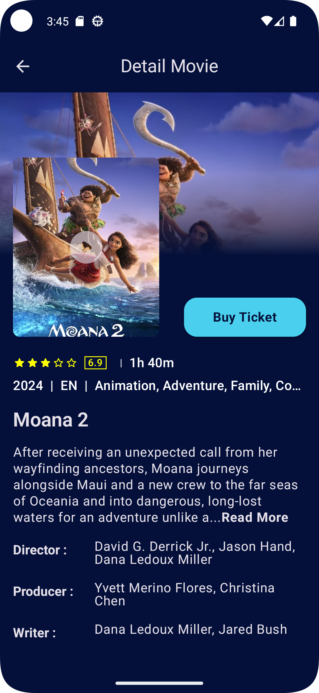
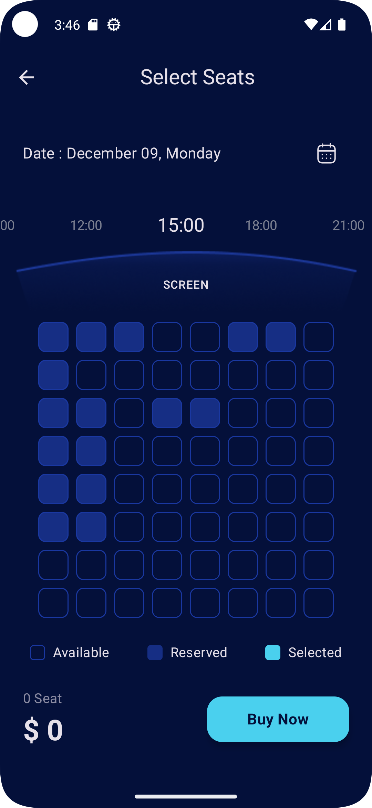
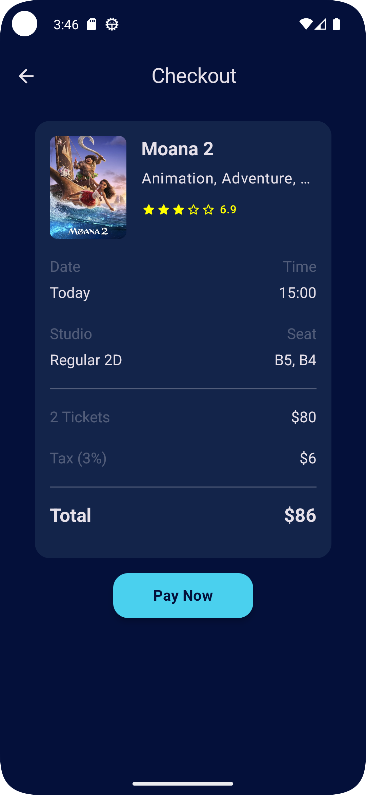
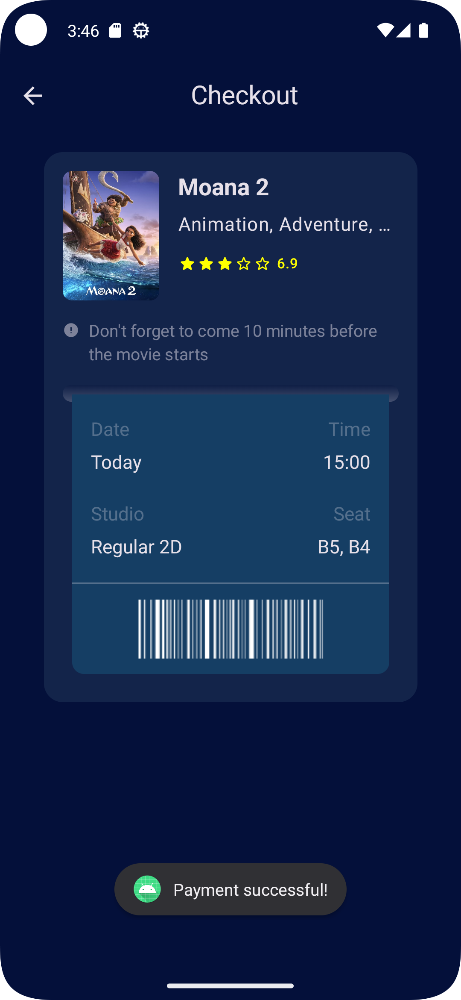
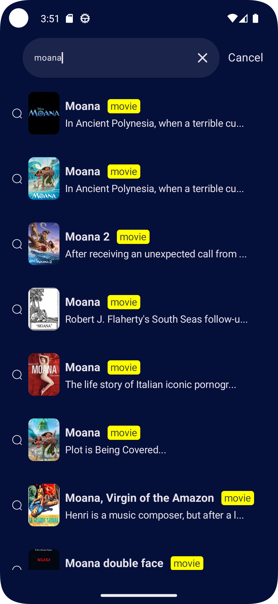
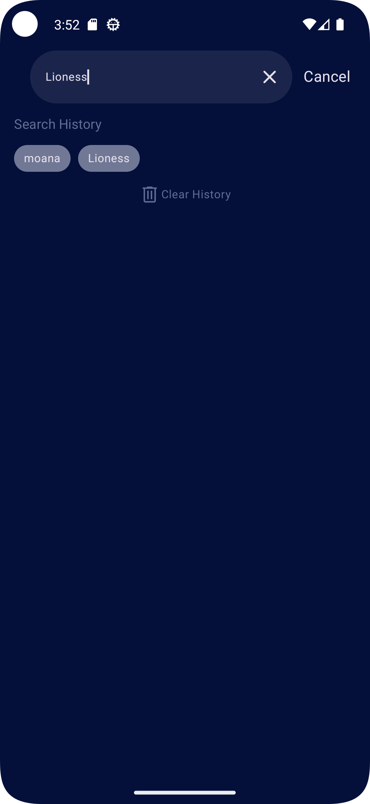

# Movie Ticket Project

Welcome to my project! Here's some useful links:

Minimum SDK level 24
- [Kotlin](https://kotlinlang.org/)
- [Courotines](https://github.com/Kotlin/kotlinx.coroutines)
- [Flow](https://kotlinlang.org/api/kotlinx.coroutines/kotlinx-coroutines-core/kotlinx.coroutines.flow/)
- [Hilt](https://dagger.dev/hilt/)
- [Coil](https://github.com/coil-kt/coil)
- [Paging3](https://developer.android.com/topic/libraries/architecture/paging/v3-migration)
- [Serialization](https://kotlinlang.org/docs/serialization.html)
- [Parcelable](https://developer.android.com/kotlin/parcelize)
- [Compose](https://developer.android.com/jetpack/compose)
- [Material3](https://developer.android.com/jetpack/androidx/releases/compose-material3)
- [Room](https://developer.android.com/jetpack/androidx/releases/room)
- [DataStore](https://developer.android.com/topic/libraries/architecture/datastore)
- [State Management](https://developer.android.com/develop/ui/compose/state)
- [Navigation](https://developer.android.com/guide/navigation)
- [Stripe](https://stripe.com/nz/payments)
- [Cloud Firestore](https://firebase.google.com/docs/firestore)

## Screenshot

<table>
  <tr>
    <td></td>
    <td></td>
    <td></td>
    <td></td>
  </tr>

  <tr>
    <td></td>
    <td></td>
    <td></td>
    <td></td>
  </tr>
</table>

### Installation
1. Clone the repository: git clone https://github.com/SoeMoeAung060/movie-app.git
2. Open the project in Android Studio.
3. Build and Run the app on an Android device or emulator.

### License
This project is licensed under the MIT License. See the [LICENSE](./LINCENSE) file for more details.
